JPetStore
=========
JPetStore is a full web application built on top of MyBatis 3, Spring 5 and Stripes.
This will describe the deployment process for a Java-based Petshop application using Jenkins as a CI/CD tool. This deployment uses Docker for containerization, Kubernetes for container orchestration, and includes various security measures and automation tools such as Terraform, SonarQube and Ansible. This project demonstrates a comprehensive approach to modern application deployment, with a focus on automation, security, and scalability.

This project was an incredible learning experience that provided hands-on exposure to a variety of tools and technologies critical to modern DevOps practices.

  WARNING
  -------
Before proceeding, ensure you read and understand the code properly. Make necessary changes to variables such as GitHub repository URLs, credentials, DockerHub usernames etc. Failure to update these variables can affect the deployment process. Always double-check configurations and ensure they align with your environment.

 Project Overview
 ----------------
The goal of this project is to deploy a Java-based Petshop application in a secure, scalable, and automated manner. Here are the key components and tools used:

- Jenkins for Continuous Integration and Continuous Deployment (CI/CD)

- Docker for containerizing the application

- Kubernetes for orchestrating the containers

- Terraform for Infrastructure as Code (IaC)

- SonarQube for static code analysis and quality assurance

- Ansible for configuration management.

  Detailed Pipeline Explanation
  -----------------------------
Commit to GitHub:
• Action: Developers write code and commit their changes to the GitHub repository.
• Importance: Centralized code management ensures version control and collaboration.

Jenkins Build Trigger:
• Action: Jenkins monitors the GitHub repository for new commits. When a new commit is detected, Jenkins triggers the pipeline.
• Importance: Automates the integration process, reducing manual intervention and speeding up development cycles.

Maven Build:
• Action: Jenkins uses Maven to build the project. Maven compiles the code and packages it into a deployable format (e.g., a JAR file).
• Importance: Ensures that the application can be consistently built from source code.

Dependency-Check:
• Action: Maven integrates with Dependency-Check to scan for vulnerabilities in the project’s dependencies.
• Importance: Identifies and mitigates potential security risks in third-party libraries early in the development process.

Ansible Docker Playbook:
• Action: Ansible playbooks automate the setup of Docker containers. Jenkins uses Ansible to ensure that the Docker environment is correctly configured.
• Importance: Simplifies environment setup and configuration management, ensuring consistency across different environments.

Docker Containerization:
• Action: The application is containerized using Docker, which packages the application and its dependencies into a container.
• Importance: Containers provide a consistent runtime environment, reducing issues related to “works on my machine” syndrome.

Maven Compile and Test:
• Action: Maven compiles the code and runs tests to verify that the application works as expected.
• Importance: Automated testing ensures that code changes do not introduce new bugs.

SonarQube Analysis:
• Action: Jenkins integrates with SonarQube to perform static code analysis, checking for code quality and security issues.
• Importance: Maintains high code quality and security standards, ensuring that the application is reliable and maintainable.

Kubernetes Deployment:
• Action: Jenkins deploys the containerized application to a Kubernetes cluster.
• Importance: Kubernetes manages the deployment, scaling, and operations of the application, ensuring high availability and reliability.

Detailed Step-by-Step Guide
===========================
1.Step 1: Create an Ubuntu (22.04) T2 Large Instance using Terraform
--------------------------------------------------------------------
Us Terraform IaC to launch an EC2 instance on AWS. Create a main.tf file with the following Terraform configuration to provision an AWS EC2 instance:
```
# Provider configuration
provider "aws" {
  region = "eu-central-1" # Specify the region
}

# Create a new security group that allows all inbound and outbound traffic
resource "aws_security_group" "allow_all" {
  name        = "allow_all_traffic"
  description = "Security group that allows all inbound and outbound traffic"

  ingress {
    from_port   = 0
    to_port     = 0
    protocol    = "-1"
    cidr_blocks = ["0.0.0.0/0"]
  }

  egress {
    from_port   = 0
    to_port     = 0
    protocol    = "-1"
    cidr_blocks = ["0.0.0.0/0"]
  }
}

# Launch an EC2 instance
resource "aws_instance" "my_ec2_instance" {
  ami             = "ami-01f79b1e4a5c64257" # Replace with a valid Ubuntu AMI ID for region
  instance_type   = "t2.large"
  key_name        = "key_name" # Replace with your actual key pair name
  security_groups = [aws_security_group.allow_all.name]

  # Configure root block device
  root_block_device {
    volume_size = 30
  }

  tags = {
    Name = "MyUbuntuInstance"
  }
}
```
Step 2: Install Jenkins and Docker
-------------------------------------------
SSH into the EC2 instance with your key pair and run the following commands:
```
# Update packages
sudo apt update -y

# Install Java
sudo apt install -y openjdk-21-jdk

# Install Jenkins
curl -fsSL https://pkg.jenkins.io/debian/jenkins.io-2026.key | sudo tee \
  /usr/share/keyrings/jenkins-keyring.asc > /dev/null
echo deb [signed-by=/usr/share/keyrings/jenkins-keyring.asc] \
  https://pkg.jenkins.io/debian binary/ | sudo tee \
  /etc/apt/sources.list.d/jenkins.list > /dev/null

sudo apt update -y
sudo apt install jenkins -y
sudo sed -i 's|^#\?JAVA_HOME=.*|JAVA_HOME=/usr/lib/jvm/java-21-openjdk-amd64|' /etc/default/jenkins
sudo systemctl daemon-reexec
sudo systemctl daemon-reload
sudo systemctl enable --now jenkins

# Install Docker
sudo apt install -y ca-certificates curl gnupg apt-transport-https software-properties-common
sudo install -m 0755 -d /etc/apt/keyrings
curl -fsSL https://download.docker.com/linux/ubuntu/gpg \
| sudo gpg --dearmor -o /etc/apt/keyrings/docker.gpg
sudo chmod a+r /etc/apt/keyrings/docker.gpg
echo \
"deb [arch=$(dpkg --print-architecture) signed-by=/etc/apt/keyrings/docker.gpg] \
https://download.docker.com/linux/ubuntu $(lsb_release -cs) stable" \
| sudo tee /etc/apt/sources.list.d/docker.list > /dev/null
sudo apt update -y
sudo apt install -y docker-ce docker-ce-cli containerd.io
sudo usermod -aG docker $USER
sudo usermod -aG docker jenkins

#Reboot system!!!
sudo reboot
```
Since Apache Maven’s default proxy is 8080, we need to change the port of Jenkins from 8080 to let’s say 8090, for that:
```
sudo systemctl stop jenkins
sudo vi /etc/default/jenkins #chnage port HTTP_PORT=8090 and save and exit
```
```
sudo vi /lib/systemd/system/jenkins.service 
#change Environments="Jenkins_port=8090" save and exit
```
```
sudo systemctl daemon-reload
sudo systemctl restart jenkins
```
Now, go to http://<EC2_Public_IP:8090>
```
# for jenkins password
sudo cat /var/lib/jenkins/secrets/initialAdminPassword
# change the password once you set up jenkins server
```
Install suggested plugins and creat user.
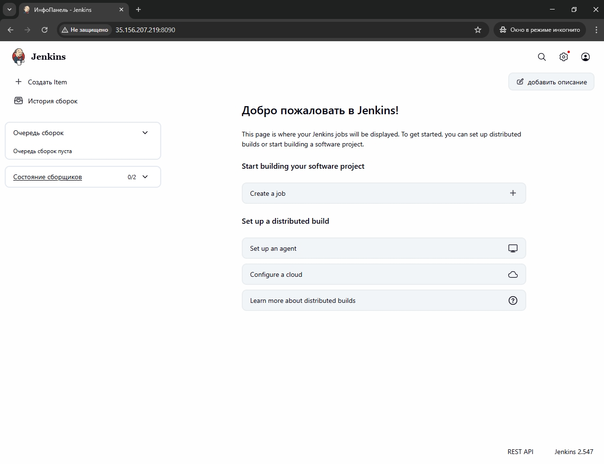
Then create a SonarQube container:
```
docker run -d --name sonar -p 9000:9000 sonarqube:lts-community
```
Now our SonarQube is up and running on <EC2_Public_IP:9000>.
Enter username and password, click on login and change password.
```
username admin
password admin
```
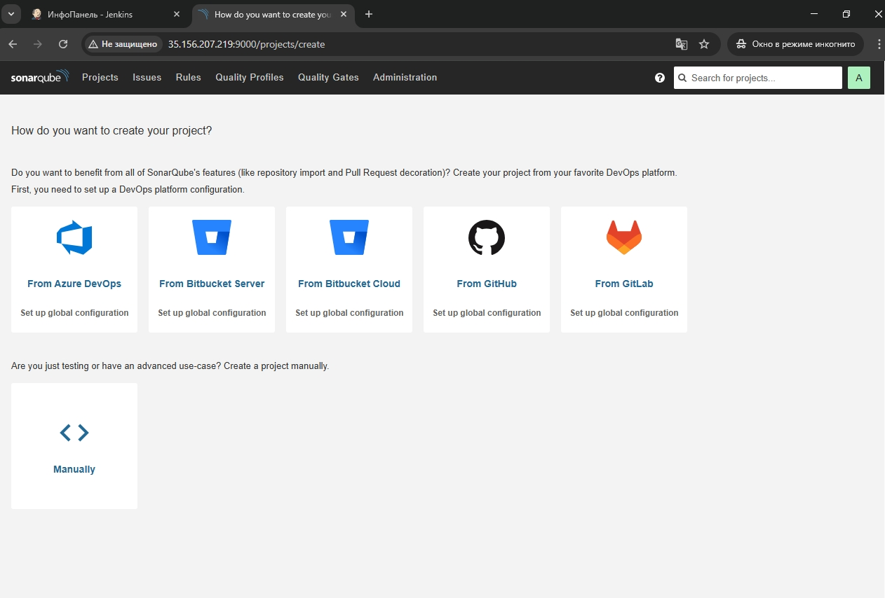

Step 3: Install Plugins in Jenkins
----------------------------------
In Jenkins, navigate to Manage Jenkins -> Available Plugins and install the following plugins:

- Eclipse Temurin Installer
- SonarQube Scanner
- Maven Integration
- OWASP Dependency-Check

Configure Java and Maven in Global Tool Configuration
Go to Manage Jenkins → Tools → Install JDK(17) and Maven3(3.6.0) → Click on Apply and Save

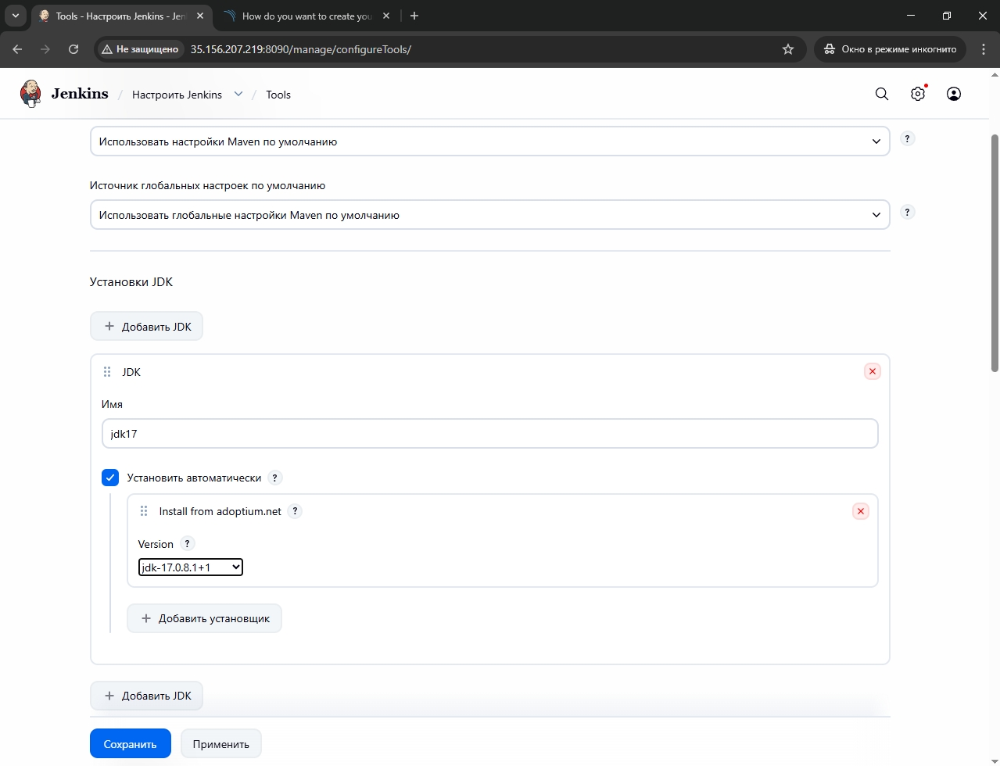
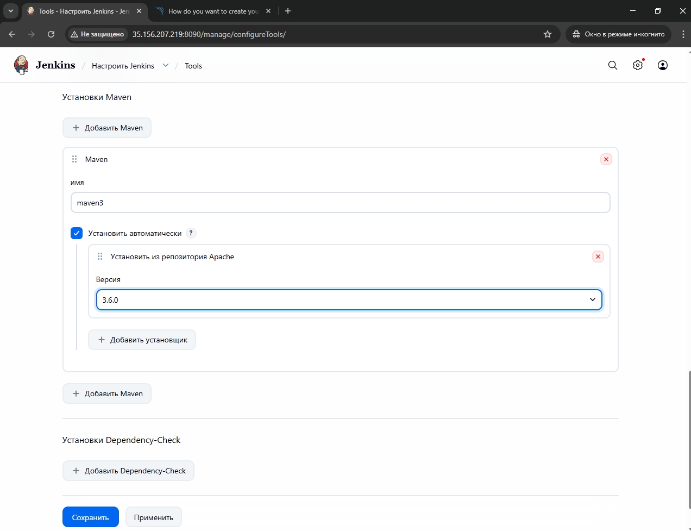

Create a New Job with a Pipeline option and use script:
```
pipeline{
    agent any
    tools {
        jdk 'jdk17'
        maven 'maven3'
    }
    stages{
        stage ('clean Workspace'){
            steps{
                cleanWs()
            }
        }
        stage ('checkout scm') {
            steps {
                git 'https://github.com/Pavlo-1992/jpetstore'  # Replace for your repo!
            }
        }
        stage ('maven compile') {
            steps {
                sh 'mvn clean compile'
            }
        }
        stage ('maven Test') {
            steps {
                sh 'mvn test'
            }
        }
   }
}
```
Step 4: Configure SonarQube Server in Jenkins
---------------------------------------------
Since SonarQube operates on Port 9000, you can access it via <EC2_Public_IP>:9000.

To proceed, navigate to your SonarQube server, then follow these steps:
Click on Administration → Security → Users → Tokens. Next, update and copy the token by providing a name and clicking on Generate Token.

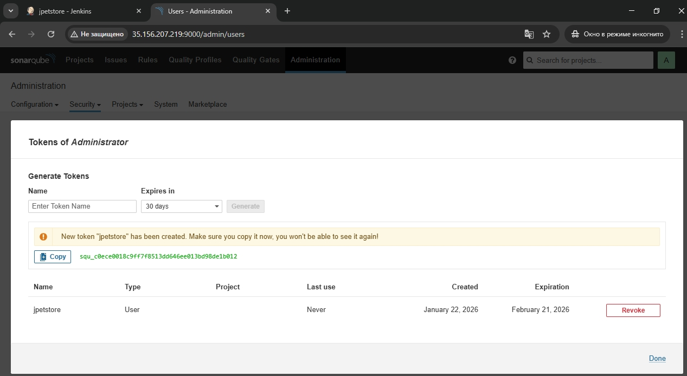

Go to the Jenkins Dashboard, then navigate to Manage Jenkins → Credentials → Add Secret Text. The screen should look like this:

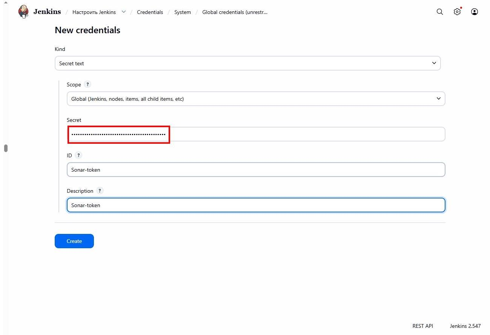

Next, go to the Jenkins Dashboard, then navigate to Manage Jenkins → System, and add the necessary configuration as shown in the image below.

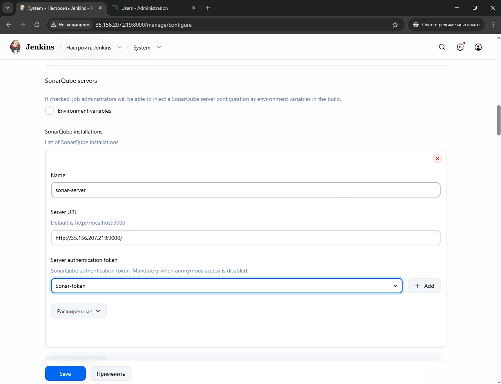  

Click on apply and save
Now, we will install a sonar scanner in the tools.

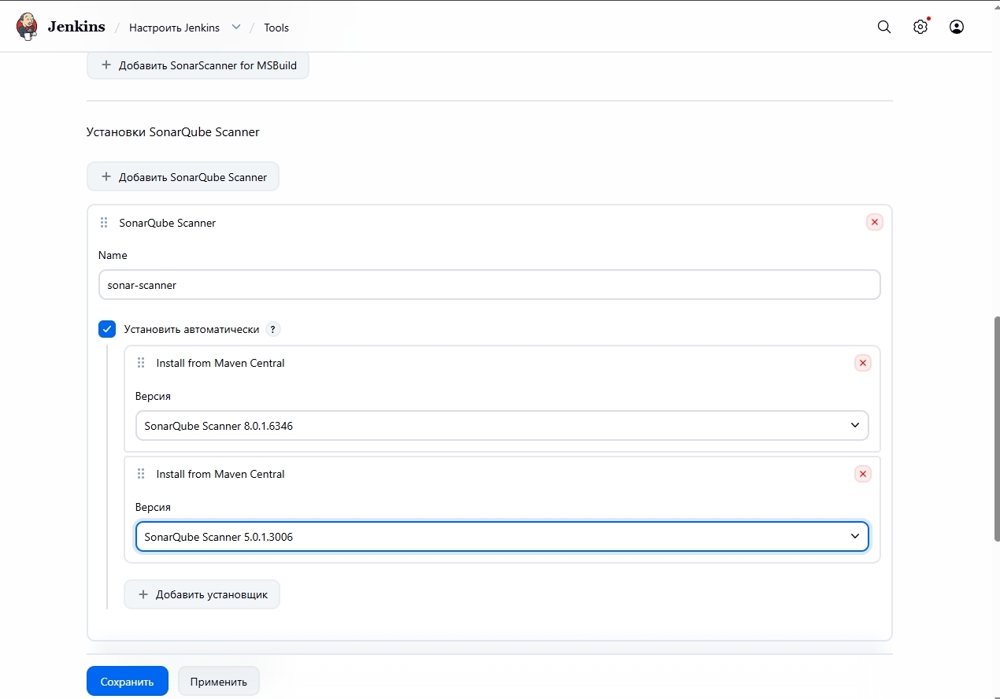

Click on apply and save
In the SonarQube Dashboard, add a quality gate by navigating to Administration → Configuration → Webhooks → Create. Leave the secret box blank!!!

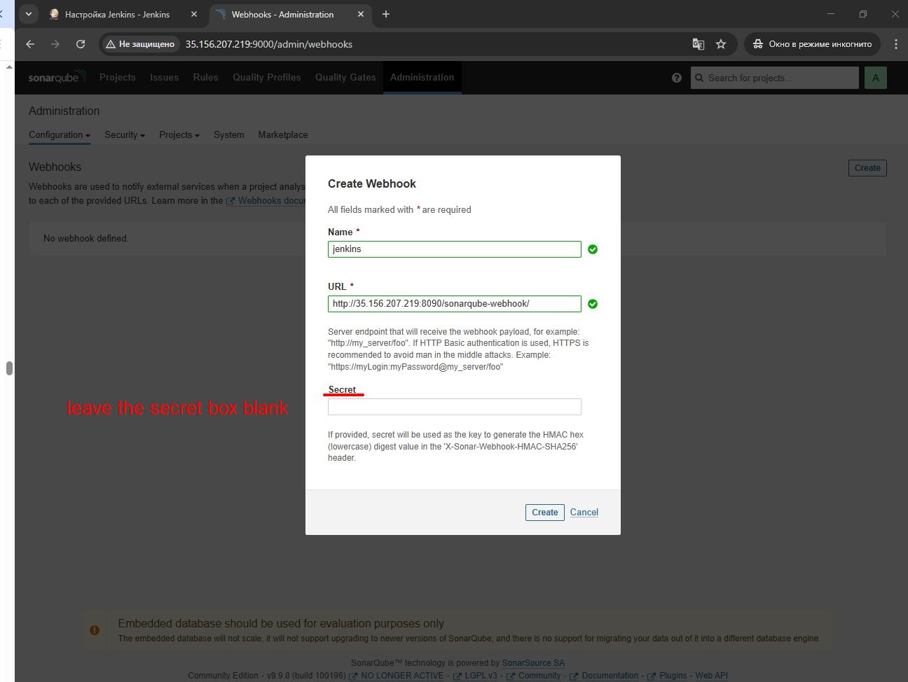

Now add this script in pipeline (Dashboard→ petstore→ configuration) and test the steps of SonarQube:
```
pipeline {
    agent any

    tools {
        jdk 'jdk17'
        maven 'maven3'
    }

    environment {
        SCANNER_HOME = tool 'sonar-scanner'
    }

    stages {
        stage('Clean Workspace') {
            steps {
                cleanWs()
            }
        }

        stage('Checkout SCM') {
            steps {
                git 'https://github.com/Pavlo-1992/jpetstore' # Replace for your repo!
            }
        }

        stage('Maven Compile') {
            steps {
                sh 'mvn clean compile'
            }
        }

        stage('Maven Test') {
            steps {
                sh 'mvn test'
            }
        }

        stage('Sonarqube Analysis') {
            steps {
                withSonarQubeEnv('sonar-server') {
                    sh ''' 
                        $SCANNER_HOME/bin/sonar-scanner \
                        -Dsonar.projectName=Petshop \
                        -Dsonar.java.binaries=. \
                        -Dsonar.projectKey=Petshop
                    '''
                }
            }
        }

        stage('Quality Gate') {
            steps {
                script {
                    waitForQualityGate abortPipeline: false, credentialsId: 'sonar-token'
                }
            }
        }
    }
}
```

Apply, save and build. Now, go to your SonarQube Server and go to project and see the result:

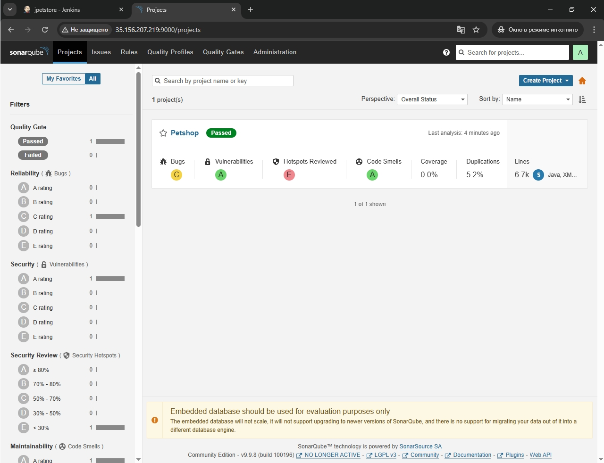

Step 5: Install OWASP Dependency Check Plugins
----------------------------------------------
Proceed to configure the tool by navigating to Dashboard → Manage Jenkins → Tools →.


Get an NVD API key. Register here: https://nvd.nist.gov/developers/request-an-api-key
Save the key
Add the key to Jenkins
In Jenkins, go to Manage Jenkins → Credentials
Create a new "Secret text":

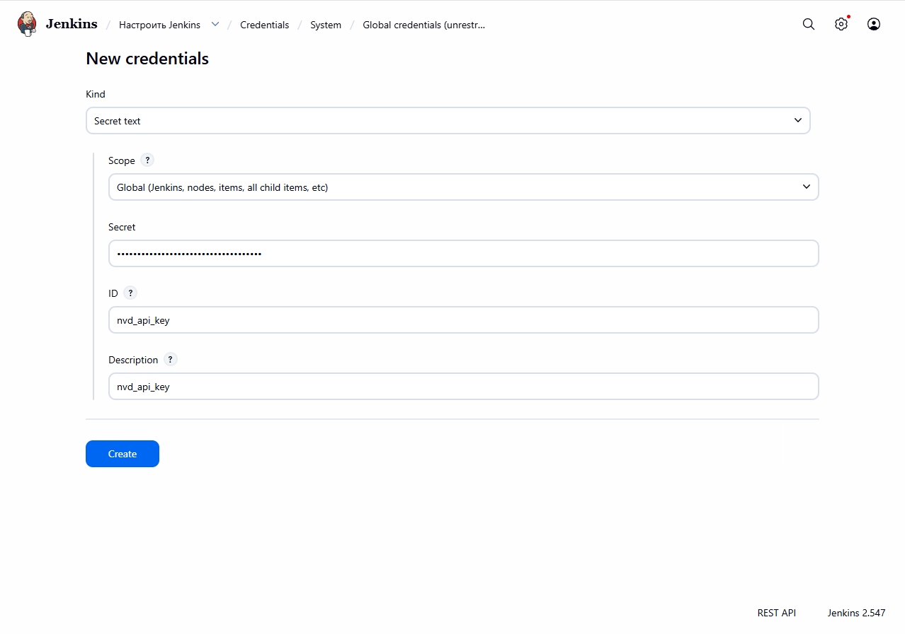

Add the script in pipeline:
```
pipeline {
    agent any

    tools {
        jdk 'jdk17'
        maven 'maven3'
    }

    environment {
        SCANNER_HOME = tool 'sonar-scanner'
    }

    stages {
        stage('Clean Workspace') {
            steps {
                cleanWs()
            }
        }

        stage('Checkout SCM') {
            steps {
                git 'https://github.com/Pavlo-1992/jpetstore' # Replace for your repo!
            }
        }

        stage('Maven Compile') {
            steps {
                sh 'mvn clean compile'
            }
        }

        stage('Maven Test') {
            steps {
                sh 'mvn test'
            }
        }

        stage('Build war file') {
            steps {
                sh 'mvn clean install -DskipTests=true'
            }
        }

        stage('Sonarqube Analysis') {
            steps {
                withSonarQubeEnv('sonar-server') {
                    sh '''
                        $SCANNER_HOME/bin/sonar-scanner \
                        -Dsonar.projectName=Petshop \
                        -Dsonar.projectKey=Petshop \
                        -Dsonar.java.binaries=.
                    '''
                }
            }
        }

        stage('Quality Gate') {
            steps {
                script {
                    waitForQualityGate abortPipeline: false, credentialsId: 'sonar-token'
                }
            }
        }

        stage('OWASP Dependency Check') {
            steps {
                withCredentials([string(credentialsId: 'nvd_api_key', variable: 'nvd_api_key')]) {
                    dependencyCheck additionalArguments: "--scan ./ --format XML --nvdApiKey ${nvd_api_key}", odcInstallation: 'dp-check'
                    dependencyCheckPublisher pattern: '**/dependency-check-report.xml'
                }
            }
        }
    }
}
```
You can see the report:


Step 6: Docker Set-up
---------------------
In Jenkins, navigate to Manage Jenkins -> Available Plugins and install these:
- Docker - Docker Commons - Docker Pipeline - Docker API - docker-build-step

Now, go to Dashboard → Manage Jenkins → Tools →

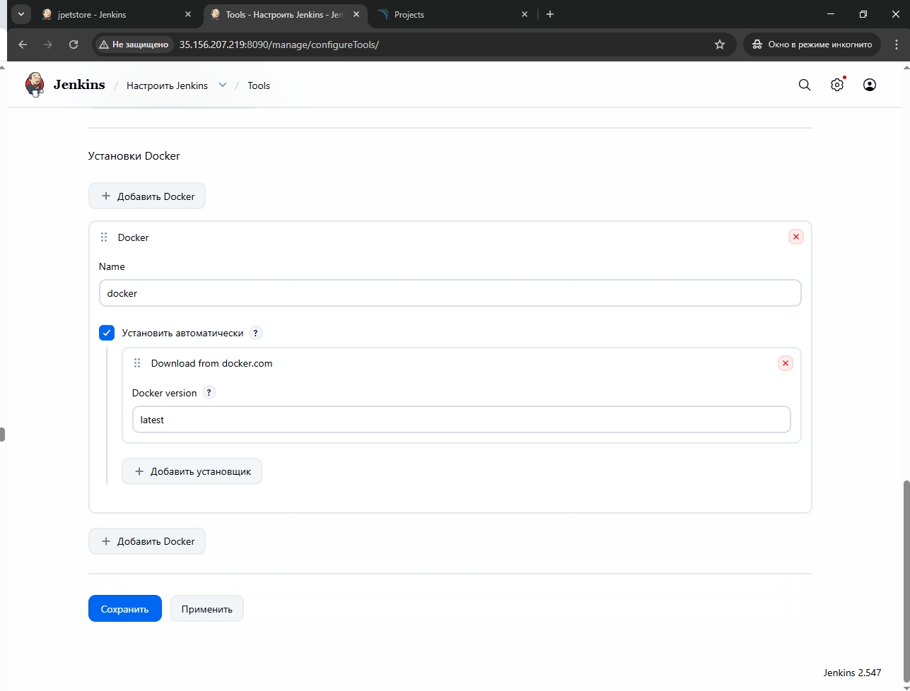

Add DockerHub Username and Password (Access Token) in Global Credentials:

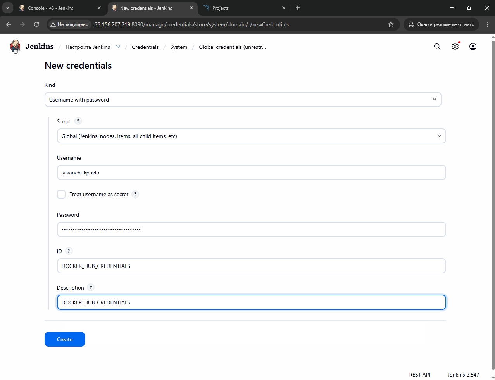

Step 7: Adding Ansible Repository and Install Ansible.
-----------------------------------------------------
Connect to your instance via SSH and run this commands, to install Ansible on your Jenkins server:
```
sudo apt update -y
sudo apt install software-properties-common -y
sudo add-apt-repository --yes --update ppa:ansible/ansible
sudo apt install ansible -y
sudo apt install ansible-core -y
```
To add inventory you can create a new directory or add in the default Ansible hosts file:
```
sudo vi /etc/ansible/hosts
```
```
[local]
<Public_IP_Jenkins> ansible_user=ubuntu
```
Save and exit.

Install Ansible Plugins by navigating to Manage Jenkins -> Available Plugins.

In Jenkins generete ssh-key:
```
cd ~/.ssh/
sudo ssh-keygen -t rsa -b 2048 -f jpetstore_rsa
```
```
cat jpetstore_rsa.pub >> ~/.ssh/authorized_keys
chmod 600 ~/.ssh/authorized_keys
```

Now add Credentials to invoke Ansible with Jenkins (private key - jpetstore_rsa ).
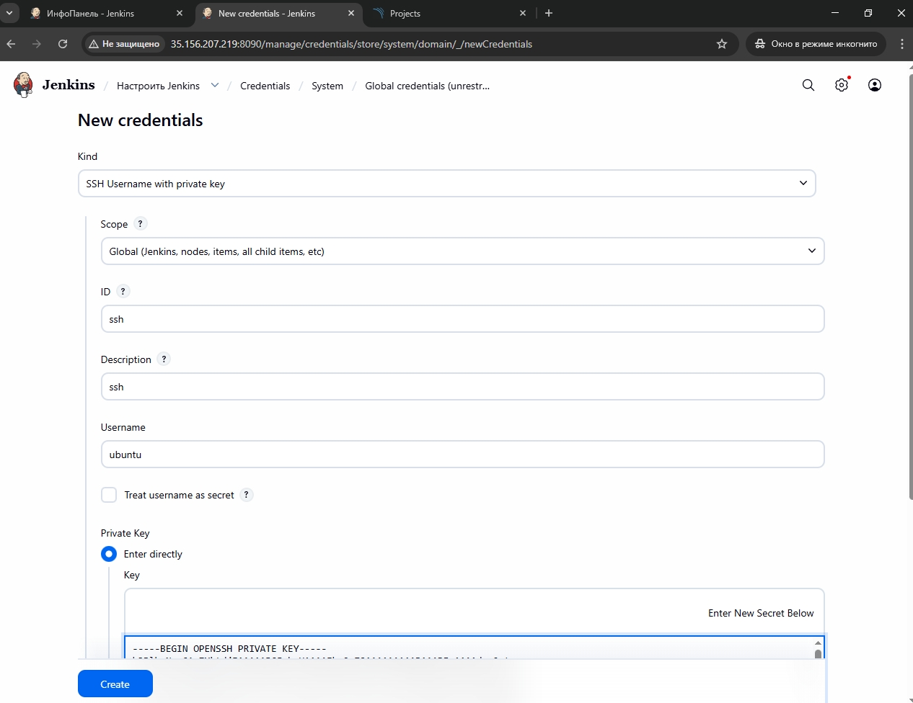
In the Private key section, paste your jpetstore_rsa key file content directly.

Check your Ansible path on the server by:
```
which ansible
```
Copy the path and paste it here:

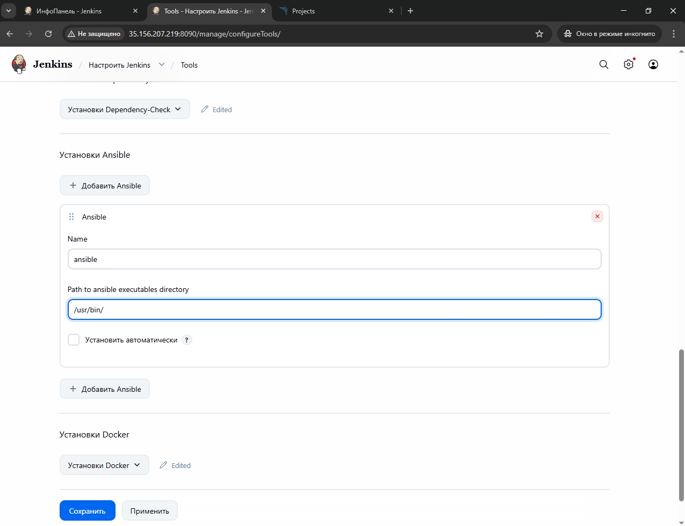

Now, create an Ansible playbook that builds a Docker image, tags it, pushes it to Docker Hub, and then deploys it in a container using Ansible.

It is already in github repo but you need to modify with your DockerHub credentials:

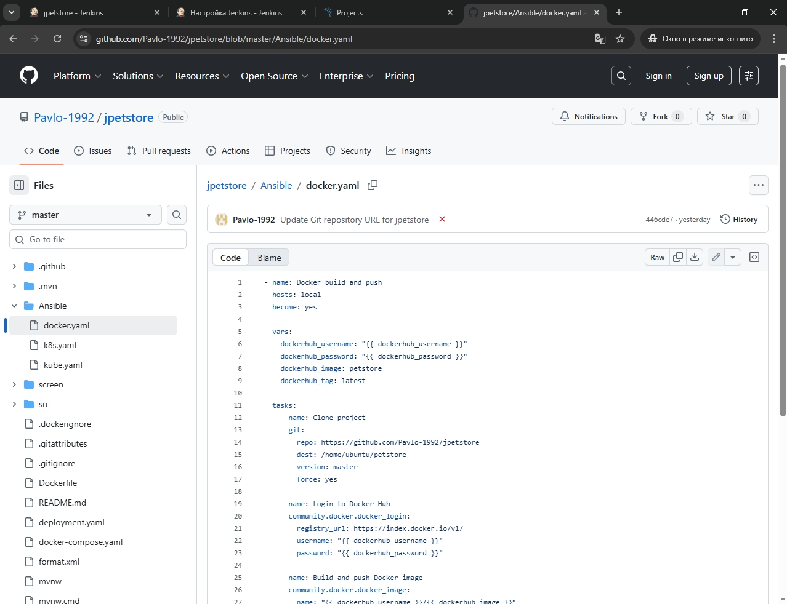

Add the script in pipeline:
```
pipeline {
    agent any

    tools {
        jdk 'jdk17'
        maven 'maven3'
    }

    environment {
        SCANNER_HOME = tool 'sonar-scanner'
    }

    stages {

        stage('Clean Workspace') {
            steps {
                cleanWs()
            }
        }

        stage('Checkout SCM') {
            steps {
                git 'https://github.com/Pavlo-1992/jpetstore' # Replace for your repo!
            }
        }

        stage('Maven Compile') {
            steps {
                sh 'mvn clean compile'
            }
        }

        stage('Maven Test') {
            steps {
                sh 'mvn test'
            }
        }

        stage('Build WAR') {
            steps {
                sh 'mvn clean install -DskipTests=true'
            }
        }

        stage('Sonarqube Analysis') {
            steps {
                withSonarQubeEnv('sonar-server') {
                    sh '''
                        $SCANNER_HOME/bin/sonar-scanner \
                        -Dsonar.projectName=Petshop \
                        -Dsonar.projectKey=Petshop \
                        -Dsonar.java.binaries=.
                    '''
                }
            }
        }

        stage('Quality Gate') {
            steps {
                waitForQualityGate abortPipeline: false, credentialsId: 'sonar-token'
            }
        }

        stage('OWASP Dependency Check') {
            steps {
                withCredentials([string(credentialsId: 'nvd_api_key', variable: 'nvd_api_key')]) {
                    dependencyCheck(
                        additionalArguments: "--scan ./ --format XML --nvdApiKey ${nvd_api_key}",
                        odcInstallation: 'dp-check'
                    )
                    dependencyCheckPublisher pattern: '**/dependency-check-report.xml'
                }
            }
        }

        stage('Install Docker (Ansible)') {
            steps {
                withCredentials([
                    usernamePassword(
                        credentialsId: 'DOCKER_HUB_CREDENTIALS',
                        usernameVariable: 'DOCKER_HUB_USERNAME',
                        passwordVariable: 'DOCKER_HUB_PASSWORD'
                    )
                ]) {
                    dir('Ansible') {
                        ansiblePlaybook(
                            installation: 'ansible',
                            playbook: 'docker.yaml',
                            inventory: '/etc/ansible/hosts',
                            disableHostKeyChecking: true,
                            credentialsId: 'ssh',
                            extraVars: [
                                dockerhub_username: "${DOCKER_HUB_USERNAME}",
                                dockerhub_password: "${DOCKER_HUB_PASSWORD}"
                            ]
                        )
                    }
                }
            }
        }

    }
}
```

After build process of the pipeline you would be able to see the result of web application by visiting the below url
```
 <jenkins-ip:8081>/jpetstore
```

  

Step 8: Kubernetes Setup
------------------------
Create two instance for Kubernetes Master-Slave set up, you can use the below terraform code:
```
provider "aws" {
  region = "eu-central-1" # Specify the region
}

resource "aws_instance" "my_ec2_instance1" {
  ami           = "ami-0a854fe96e0b45e4e"  # Replace with a valid Ubuntu AMI ID for region
  instance_type = "t2.medium"
  key_name      = "key_name" # Replace with your actual key pair name
  vpc_security_group_ids = ["sg-id"]  #Replace with security group ID that allows all inbound and outbound traffic

  associate_public_ip_address = true

  root_block_device {
    volume_size = 8
  }

  tags = {
    Name = "k8s-master"
  }
}

resource "aws_instance" "my_ec2_instance2" {
  ami           = "ami-0a854fe96e0b45e4e"  # Replace with a valid Ubuntu AMI ID for region
  instance_type = "t2.medium"
  key_name      = "key_name" # Replace with your actual key pair name
  vpc_security_group_ids = ["sg-id"]  #Replace with security group ID that allows all inbound and outbound traffic

  associate_public_ip_address = true

  root_block_device {
    volume_size = 8
  }

  tags = {
    Name = "k8s-worker"
  }
}
```

Install Kubectl and Minikube on Jenkins machine:
```
#System update and installation of utilities
sudo apt-get update 
sudo apt-get install -y ca-certificates curl gnupg lsb-release

#Installing kubectl via snap
sudo snap install kubectl --classic

#Installing Minikube
curl -LO https://storage.googleapis.com/minikube/releases/latest/minikube-linux-amd64 
sudo install minikube-linux-amd64 /usr/local/bin/minikube 
rm minikube-linux-amd64

#Starting Minikube
minikube start
```

Now run this commands in both master and worker node:
```
#System update
sudo apt-get update

#Disable SWAP (CRITICAL, BEFORE kubeadm)
sudo swapoff -a
sudo sed -i '/ swap / s/^/#/' /etc/fstab

#Configure kernel modules and sysctl (BEFORE containerd)
#Kernel modules
sudo apt install -y linux-modules-extra-$(uname -r)

cat <<EOF | sudo tee /etc/modules-load.d/k8s.conf
br_netfilter
EOF

sudo modprobe br_netfilter

#Sysctl
cat <<EOF | sudo tee /etc/sysctl.d/99-kubernetes.conf
net.bridge.bridge-nf-call-iptables=1
net.bridge.bridge-nf-call-ip6tables=1
net.ipv4.ip_forward=1
EOF

sudo sysctl --system

#Install containerd (RECOMMENDED separately from Docker)
#Docker is NOT REQUIRED for Kubernetes
sudo apt install -y containerd

#Generate and fix config.toml
sudo mkdir -p /etc/containerd
containerd config default | sudo tee /etc/containerd/config.toml

#Open the file:
 sudo vi /etc/containerd/config.toml
#Ensure SystemdCgroup is set to true:
#[plugins."io.containerd.grpc.v1.cri".containerd.runtimes.runc.options]
#SystemdCgroup = true

#Restart and enable containerd
sudo systemctl restart containerd
sudo systemctl enable containerd
sudo systemctl status containerd

#Configure crictl (IMPORTANT)
sudo tee /etc/crictl.yaml <<EOF
runtime-endpoint: unix:///run/containerd/containerd.sock
image-endpoint: unix:///run/containerd/containerd.sock
timeout: 10
debug: false
EOF

#Install Kubernetes components (kubeadm, kubelet, kubectl)
#Аdd official repository
sudo mkdir -p /etc/apt/keyrings
curl -fsSL https://pkgs.k8s.io/core:/stable:/v1.28/deb/Release.key | \
  sudo gpg --dearmor -o /etc/apt/keyrings/kubernetes-apt-keyring.gpg

echo "deb [signed-by=/etc/apt/keyrings/kubernetes-apt-keyring.gpg] \
https://pkgs.k8s.io/core:/stable:/v1.28/deb/ /" | \
sudo tee /etc/apt/sources.list.d/kubernetes.list

#Install packages
sudo apt update
sudo apt install -y kubelet kubeadm kubectl
sudo apt-mark hold kubelet kubeadm kubectl

#Reboot (RECOMMENDED)
sudo reboot
```
#ALL COMMANDS BELOW SHOULD BE EXECUTED AFTER REBOOT (ON MASTER NODE)
--------------------------------------------------------------------
```
#Initialize control-plane
sudo kubeadm init \
  --pod-network-cidr=10.244.0.0/16 \
  --apiserver-advertise-address=<Private_ip_master_node> \
  --cri-socket=unix:///run/containerd/containerd.sock
```
```
#Configure kubectl (Non-root user)
mkdir -p $HOME/.kube
sudo cp /etc/kubernetes/admin.conf $HOME/.kube/config
sudo chown $(id -u):$(id -g) $HOME/.kube/config
```
Check:
```
kubectl get nodes
```
(will be NotReady - this is NORMAL)

Installing CNI (Flannel)
```
kubectl apply -f https://github.com/flannel-io/flannel/releases/latest/download/kube-flannel.yml
```
After 30-60 seconds:
```
kubectl get nodes
```
Waiting for:
STATUS: Ready

Then:
```
kubeadm token create --print-join-command
```
Copy and in worker instance:
-------------------
```
sudo kubeadm join <Private_ip_master_node>:<master-node-port> --token <token> --discovery-token-ca-cert-hash <hash>
```
On master instanse:
```
kubectl get node
```
We have to get:
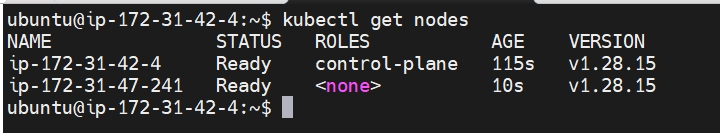 

Copy the config file from master node to Jenkins machine or the local file manager and save it, you can find it in master node by:
```
cat ~/.kube/config
```
Copy it and save it in documents or another folder save it as secret-file.txt.

Install k8s plugins in jenkin:
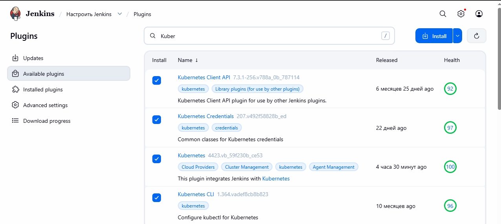

Now, go to Manage Jenkins –> Credentials –>System–> Global Credential–> Add Credentials
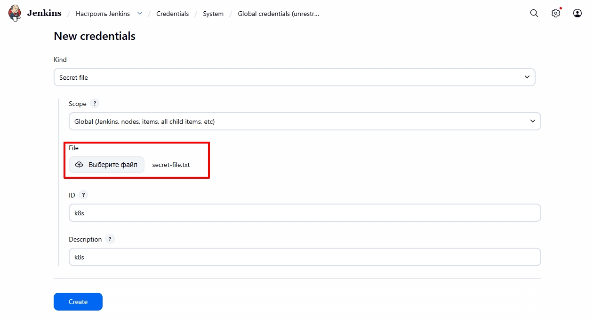

Step 9: Master-Slave Setup for Ansible and Kubernetes
-----------------------------------------------------
To enable communication with Kubernetes clients, we need to create an SSH key on the Jenkins node and provide it to the Kubernetes master, or we can use the key we created earlier. We will use the key we created earlier - jpetstore_rsa.

On main (on which we are running jenkins, not the master-worker) instance:
```
sudo chown ubuntu:ubuntu ~/.ssh/jpetstore_rsa ~/.ssh/jpetstore_rsa.pub
```
```
chmod 600 ~/.ssh/jpetstore_rsa
chmod 644 ~/.ssh/jpetstore_rsa.pub
chmod 700 ~/.ssh
```
```
cat ~/.ssh/jpetstore_rsa.pub
```

After copying the public key from the Jenkins Machine, navigate to the .ssh directory on the Kubernetes master machine and paste the copied public key into the authorized_keys file.
Note: Add the copied public key as a new line in the authorized_keys file without deleting any existing keys, past at the end jpetstore_rsa.pub then save and exit.
```
sudo vi ~/.ssh/authorized_keys #past at the end jpetstore_rsa.pub
```
Then:
```
chmod 700 ~/.ssh
chmod 600 ~/.ssh/authorized_keys
```

By adding the public key from the Jenkins to the Kubernetes machine, keyless access is now configured. To verify, try accessing the Kubernetes master using the following command format.
```
ssh -i ~/.ssh/jpetstore_rsa ubuntu@<public-ip-k8s-master>  #from Jenkins Machine
```

Now, open the hosts file on the Jenkins Machine and add the public IP of the Kubernetes master.
```
sudo vi /etc/ansible/hosts
[k8s]
public ip of k8s-master ansible_user=ubuntu
```
Test Ansible Master Slave Connection
```
ansible -i /etc/ansible/hosts all -m ping --private-key=~/.ssh/jpetstore_rsa #on jenkins instance
```

Add finaly pipeline and build the job:
```
pipeline {
    agent any

    tools {
        jdk 'jdk17'
        maven 'maven3'
    }

    environment {
        SCANNER_HOME = tool 'sonar-scanner'
    }

    stages {

        stage('Clean Workspace') {
            steps {
                cleanWs()
            }
        }

        stage('Checkout SCM') {
            steps {
                git 'https://github.com/Pavlo-1992/jpetstore' # Replace for your repo!
            }
        }

        stage('Maven Compile') {
            steps {
                sh 'mvn clean compile'
            }
        }

        stage('Maven Test') {
            steps {
                sh 'mvn test'
            }
        }

        stage('Build WAR') {
            steps {
                sh 'mvn clean install -DskipTests=true'
            }
        }

        stage('Sonarqube Analysis') {
            steps {
                withSonarQubeEnv('sonar-server') {
                    sh '''
                        $SCANNER_HOME/bin/sonar-scanner \
                        -Dsonar.projectName=Petshop \
                        -Dsonar.projectKey=Petshop \
                        -Dsonar.java.binaries=.
                    '''
                }
            }
        }

        stage('Quality Gate') {
            steps {
                waitForQualityGate abortPipeline: false, credentialsId: 'sonar-token'
            }
        }

        stage('OWASP Dependency Check') {
            steps {
                withCredentials([string(credentialsId: 'nvd_api_key', variable: 'nvd_api_key')]) {
                    dependencyCheck(
                        additionalArguments: "--scan ./ --format XML --nvdApiKey ${nvd_api_key}",
                        odcInstallation: 'dp-check'
                    )
                    dependencyCheckPublisher pattern: '**/dependency-check-report.xml'
                }
            }
        }

        stage('Install Docker (Ansible)') {
            steps {
                withCredentials([
                    usernamePassword(
                        credentialsId: 'DOCKER_HUB_CREDENTIALS',
                        usernameVariable: 'DOCKER_HUB_USERNAME',
                        passwordVariable: 'DOCKER_HUB_PASSWORD'
                    )
                ]) {
                    dir('Ansible') {
                        ansiblePlaybook(
                            installation: 'ansible',
                            playbook: 'docker.yaml',
                            inventory: '/etc/ansible/hosts',
                            disableHostKeyChecking: true,
                            credentialsId: 'ssh',
                            extraVars: [
                                dockerhub_username: "${DOCKER_HUB_USERNAME}",
                                dockerhub_password: "${DOCKER_HUB_PASSWORD}"
                            ]
                        )
                    }
                }
            }
        }

        stage('k8s using ansible') {
            steps {
                dir('Ansible') {
                    script {
                        ansiblePlaybook(
                            credentialsId: 'ssh',
                            disableHostKeyChecking: true,
                            installation: 'ansible',
                            inventory: '/etc/ansible/hosts',
                            playbook: 'kube.yaml'
                        )
                    }
                }
            }
        }

    }
}
```
In the Kubernetes cluster (on master) give this command:
```
kubectl get all
kubectl get svc
```
Then go to:
```
<public_worker_ip:serviceport>/jpetstore>
```
Your mast see:

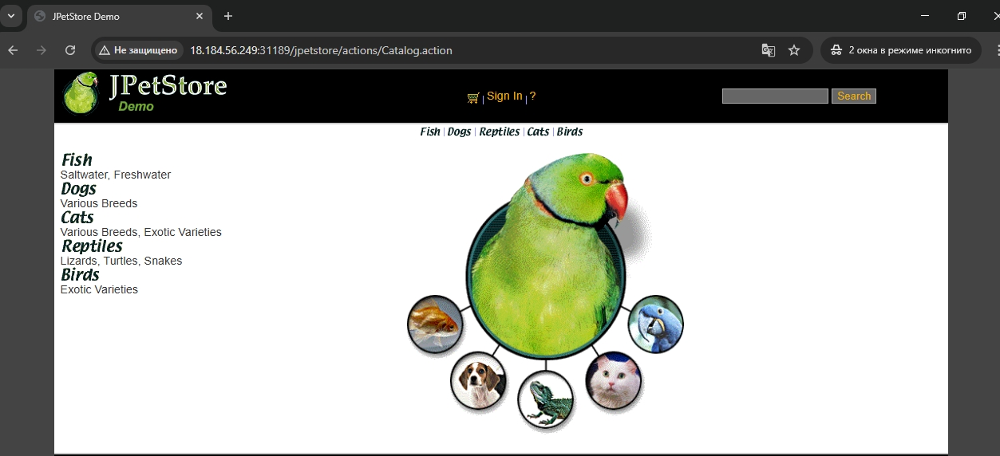 

Conclusion!
------------
By following these steps, we successfully deployed a Java-based Petshop application using Jenkins, Docker, Kubernetes, Terraform, SonarQube, and Ansible. This project not only demonstrates a comprehensive approach to modern application deployment but also highlights the importance of automation and security in the DevOps pipeline.
