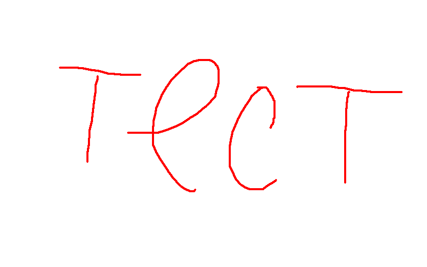

JPetStore
=================
JPetStore is a full web application built on top of MyBatis 3, Spring 5 and Stripes.
This will describe the deployment process for a Java-based Petshop application using Jenkins as a CI/CD tool. This deployment uses Docker for containerization, Kubernetes for container orchestration, and includes various security measures and automation tools such as Terraform, SonarQube, Trivy, and Ansible. This project demonstrates a comprehensive approach to modern application deployment, with a focus on automation, security, and scalability.

This project was an incredible learning experience that provided hands-on exposure to a variety of tools and technologies critical to modern DevOps practices.

  WARNING
  ----------
Before proceeding, ensure you read and understand the code properly. Make necessary changes to variables such as GitHub repository URLs, credentials, DockerHub usernames etc. Failure to update these variables can affect the deployment process. Always double-check configurations and ensure they align with your environment.

 Project Overview
 ----------------
The goal of this project is to deploy a Java-based Petshop application in a secure, scalable, and automated manner. Here are the key components and tools used:

- Jenkins for Continuous Integration and Continuous Deployment (CI/CD)

- Docker for containerizing the application

- Kubernetes for orchestrating the containers

- Terraform for Infrastructure as Code (IaC)

- SonarQube for static code analysis and quality assurance

- Trivy for container security scanning

- Ansible for configuration management.

  Detailed Pipeline Explanation
  -----------------------------
Commit to GitHub:
• Action: Developers write code and commit their changes to the GitHub repository.
• Importance: Centralized code management ensures version control and collaboration.

Jenkins Build Trigger:
• Action: Jenkins monitors the GitHub repository for new commits. When a new commit is detected, Jenkins triggers the pipeline.
• Importance: Automates the integration process, reducing manual intervention and speeding up development cycles.

Maven Build:
• Action: Jenkins uses Maven to build the project. Maven compiles the code and packages it into a deployable format (e.g., a JAR file).
• Importance: Ensures that the application can be consistently built from source code.

Dependency-Check:
• Action: Maven integrates with Dependency-Check to scan for vulnerabilities in the project’s dependencies.
• Importance: Identifies and mitigates potential security risks in third-party libraries early in the development process.

Ansible Docker Playbook:
• Action: Ansible playbooks automate the setup of Docker containers. Jenkins uses Ansible to ensure that the Docker environment is correctly configured.
• Importance: Simplifies environment setup and configuration management, ensuring consistency across different environments.

Docker Containerization:
• Action: The application is containerized using Docker, which packages the application and its dependencies into a container.
• Importance: Containers provide a consistent runtime environment, reducing issues related to “works on my machine” syndrome.

Maven Compile and Test:
• Action: Maven compiles the code and runs tests to verify that the application works as expected.
• Importance: Automated testing ensures that code changes do not introduce new bugs.

SonarQube Analysis:
• Action: Jenkins integrates with SonarQube to perform static code analysis, checking for code quality and security issues.
• Importance: Maintains high code quality and security standards, ensuring that the application is reliable and maintainable.

Trivy Security Scan:
• Action: Trivy scans Docker images for known vulnerabilities before deployment.
• Importance: Ensures that the deployed containers are secure and free from critical vulnerabilities.

Kubernetes Deployment:
• Action: Jenkins deploys the containerized application to a Kubernetes cluster.
• Importance: Kubernetes manages the deployment, scaling, and operations of the application, ensuring high availability and reliability.

Detailed Step-by-Step Guide
===========================
1.Step 1: Create an Ubuntu (22.04) T2 Large Instance using Terraform
--------------------------------------------------------------------
I am using Terraform IaC to launch an EC2 instance on AWS rather than doing traditionally, so I assume you know how to set up AWS CLI and use a Terraform. Create a main.tf file with the following Terraform configuration to provision an AWS EC2 instance:
```
# Provider configuration
provider "aws" {
  region = "eu-central-1" # Specify the region
}

# Create a new security group that allows all inbound and outbound traffic
resource "aws_security_group" "allow_all" {
  name        = "allow_all_traffic"
  description = "Security group that allows all inbound and outbound traffic"

  ingress {
    from_port   = 0
    to_port     = 0
    protocol    = "-1"
    cidr_blocks = ["0.0.0.0/0"]
  }

  egress {
    from_port   = 0
    to_port     = 0
    protocol    = "-1"
    cidr_blocks = ["0.0.0.0/0"]
  }
}

# Launch an EC2 instance
resource "aws_instance" "my_ec2_instance" {
  ami             = "ami-01f79b1e4a5c64257" # Replace with a valid Ubuntu AMI ID for region
  instance_type   = "t2.large"
  key_name        = "key_name" # Replace with your actual key pair name
  security_groups = [aws_security_group.allow_all.name]

  # Configure root block device
  root_block_device {
    volume_size = 30
  }

  tags = {
    Name = "MyUbuntuInstance"
  }
}
```
Step 2: Install Jenkins, Docker, and Trivy
-------------------------------------------
SSH into the EC2 instance with your key pair and run the following commands:
```
# Update packages
sudo apt update -y

# Install Java
sudo apt install -y openjdk-21-jdk

# Install Jenkins
curl -fsSL https://pkg.jenkins.io/debian/jenkins.io-2026.key | sudo tee \
  /usr/share/keyrings/jenkins-keyring.asc > /dev/null
echo deb [signed-by=/usr/share/keyrings/jenkins-keyring.asc] \
  https://pkg.jenkins.io/debian binary/ | sudo tee \
  /etc/apt/sources.list.d/jenkins.list > /dev/null

sudo apt update -y
sudo apt install jenkins -y
sudo sed -i 's|^#\?JAVA_HOME=.*|JAVA_HOME=/usr/lib/jvm/java-21-openjdk-amd64|' /etc/default/jenkins
sudo systemctl daemon-reexec
sudo systemctl daemon-reload
sudo systemctl enable --now jenkins

# Install Docker
sudo apt install -y ca-certificates curl gnupg apt-transport-https software-properties-common
sudo install -m 0755 -d /etc/apt/keyrings
curl -fsSL https://download.docker.com/linux/ubuntu/gpg \
| sudo gpg --dearmor -o /etc/apt/keyrings/docker.gpg
sudo chmod a+r /etc/apt/keyrings/docker.gpg
echo \
"deb [arch=$(dpkg --print-architecture) signed-by=/etc/apt/keyrings/docker.gpg] \
https://download.docker.com/linux/ubuntu $(lsb_release -cs) stable" \
| sudo tee /etc/apt/sources.list.d/docker.list > /dev/null
sudo apt update -y
sudo apt install -y docker-ce docker-ce-cli containerd.io
sudo usermod -aG docker $USER
sudo usermod -aG docker jenkins

# Install Trivy
sudo apt install wget apt-transport-https gnupg lsb-release -y
wget -qO - https://aquasecurity.github.io/trivy-repo/deb/public.key \
| gpg --dearmor | sudo tee /etc/apt/trusted.gpg.d/trivy.gpg > /dev/null
echo "deb [signed-by=/etc/apt/trusted.gpg.d/trivy.gpg] https://aquasecurity.github.io/trivy-repo/deb $(lsb_release -sc) main" \
| sudo tee /etc/apt/sources.list.d/trivy.list > /dev/null
sudo apt update -y
sudo apt install trivy -y

#Rebbot system!!!
sudo reboot
```
Since Apache Maven’s default proxy is 8080, we need to change the port of Jenkins from 8080 to let’s say 8090, for that:
```
sudo systemctl stop jenkins
cd /etc/default
sudo vi jenkins   #chnage port HTTP_PORT=8090 and save and exit

cd /lib/systemd/system
sudo vi jenkins.service  #change Environments="Jenkins_port=8090" save and exit
sudo systemctl daemon-reload
sudo systemctl restart jenkins
```
Now, go to <EC2_Public_IP_Address:8090>
```
# for jenkins password
sudo cat /var/lib/jenkins/secrets/initialAdminPassword
# change the password once you set up jenkins server
```
Install suggested plugins and creat user.

After the docker installation, we create a SonarQube container:
```
docker run -d --name sonar -p 9000:9000 sonarqube:lts-community
```
Now our SonarQube is up and running on <EC2_Public_IP_Address:9000>.
Enter username <admin> and password <admin>, click on login and change password.
screeen!!!!!!!!!!!!!!!!!

Step 3: Install Plugins in Jenkins
------------------------------------
In Jenkins, navigate to Manage Jenkins -> Available Plugins and install the following plugins:

Eclipse Temurin Installer
SonarQube Scanner
Maven Integration
OWASP Dependency-Check

Configure Java and Maven in Global Tool Configuration
Go to Manage Jenkins → Tools → Install JDK(17) and Maven3(3.6.0) → Click on Apply and Save
screeen!!!!!!!!!!!!!!!!!
screeen!!!!!!!!!!!!!!!!!


Essentials
----------

* [See the docs](http://www.mybatis.org/jpetstore-6)

## Other versions that you may want to know about

- JPetstore on top of Spring, Spring MVC, MyBatis 3, and Spring Security https://github.com/making/spring-jpetstore
- JPetstore with Vaadin and Spring Boot with Java Config https://github.com/igor-baiborodine/jpetstore-6-vaadin-spring-boot
- JPetstore on MyBatis Spring Boot Starter https://github.com/kazuki43zoo/mybatis-spring-boot-jpetstore

## Run on Application Server
Running JPetStore sample under Tomcat (using the [cargo-maven2-plugin](https://codehaus-cargo.github.io/cargo/Maven2+plugin.html)).

- Clone this repository

  ```
  $ git clone https://github.com/mybatis/jpetstore-6.git
  ```

- Build war file

  ```
  $ cd jpetstore-6
  $ ./mvnw clean package
  ```

- Startup the Tomcat server and deploy web application

  ```
  $ ./mvnw cargo:run -P tomcat90
  ```

  > Note:
  >
  > We provide maven profiles per application server as follow:
  >
  > | Profile        | Description |
  > | -------------- | ----------- |
  > | tomcat90       | Running under the Tomcat 9.0 |
  > | tomcat85       | Running under the Tomcat 8.5 |
  > | tomee80        | Running under the TomEE 8.0(Java EE 8) |
  > | tomee71        | Running under the TomEE 7.1(Java EE 7) |
  > | wildfly26      | Running under the WildFly 26(Java EE 8) |
  > | wildfly13      | Running under the WildFly 13(Java EE 7) |
  > | liberty-ee8    | Running under the WebSphere Liberty(Java EE 8) |
  > | liberty-ee7    | Running under the WebSphere Liberty(Java EE 7) |
  > | jetty          | Running under the Jetty 9 |
  > | glassfish5     | Running under the GlassFish 5(Java EE 8) |
  > | glassfish4     | Running under the GlassFish 4(Java EE 7) |
  > | resin          | Running under the Resin 4 |

- Run application in browser http://localhost:8080/jpetstore/ 
- Press Ctrl-C to stop the server.

## Run on Docker
```
docker build . -t jpetstore
docker run -p 8080:8080 jpetstore
```
or with Docker Compose:
```
docker compose up -d
```

## Try integration tests

Perform integration tests for screen transition.

```
$ ./mvnw clean verify -P tomcat90
```
